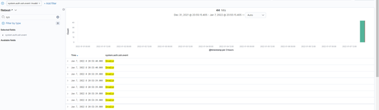

# Cloud Architect - Log Collection For Incident Response
Scenario
In this activity, you will suppose the role of a cloud architect that has been tasked with setting up an ELK server to gather logs for the Incident Response team.
Before you hand over the server to the IR team, your senior architect has asked that you verify the ELK server is working as expected and pulling both logs and metrics from the pen-testing web servers.
You will have three tasks:
1.	Generate a high amount of failed SSH login attempts and verify that Kibana is picking up this activity.

2.	Generate a high amount of CPU usage on the pen-testing machines and verify that Kibana picks up this data.

3.	Generate a high amount of web requests to your pen-testing servers and make sure that Kibana is picking them up.

SSH Barrage - Task 1
Task: Generate a high amount of failed SSH login attempts and verify that Kibana is picking up this activity.
One way we can generate logs of interest is to create some failed SSH logins on our servers.
●	The only environment that holds our SSH keys is our Ansible container. Attempting to create an SSH connection from any other environment will trigger a log entry.

●	We can also create a log entry by attempting to log in with the wrong username.

●	Note: A successful SSH login also creates a log entry, but here we will focus on failed logins.

We can easily do this by trying to SSH to a web machine from our jump box directly without using the Ansible container.

#### Single line loop command for multiple failed SSH connections:  while true; do ssh azadmin@10.0.0.6; done
 

#### Nested loop command for multiple failed SSH commands on both Web-VMS:
#### while true; do for i in 10.0.0.6 10.0.0.7; do ssh sysadmin@$i; done; done

Linux Stress - Task 2
Task: Generate a high amount of CPU usage on the pentesting machines and verify that Kibana picks up this data.
The Metrics page for a single VM shows the CPU usage for that machine. This shows how much work the machine is doing. Excessively high CPU usage is typically a cause for concern, as overworked computers are at greater risk for failure.
●	Metricbeat forwards data about CPU load to Elasticsearch, which can be visualized with Kibana.

●	In this activity, you will intentionally stress the CPU of one of your VMs, then find evidence of the increased activity in Kibana.

Linux has a common, easy-to-use diagnostic program called stress. It is easy to use and can be downloaded via apt.
#### <sudo stress --cpu 1>  
